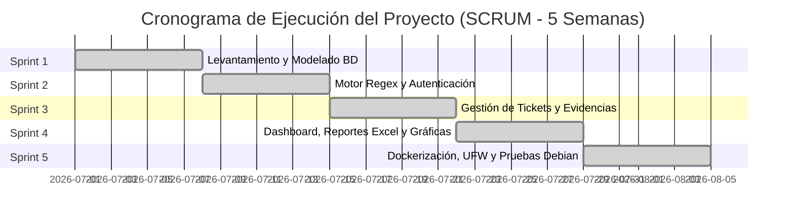
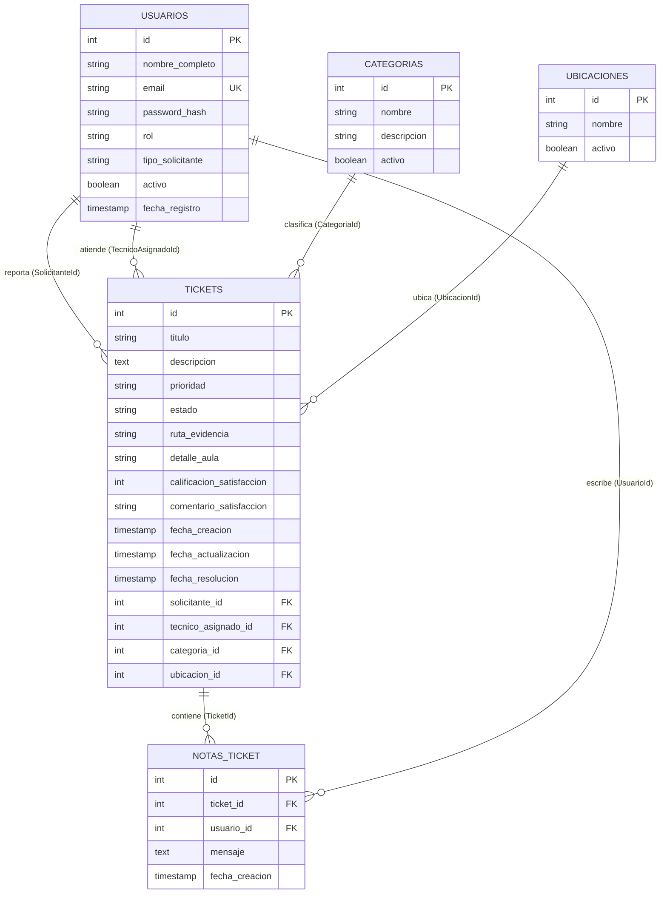

# Desarrollo e Implementación de un Sistema de Gestión de Tickets para Soporte de TI Universitario

**Juan Diego Almaguer Tolentino**  
*Matrícula: I22050319*  
*Departamento de Sistemas y Computación*  
*Instituto Tecnológico Superior de Monclova*  
Monclova, Coahuila, México  
`I22050319@monclova.tecnm.mx`

---

## Resumen
El crecimiento de la infraestructura tecnológica en las instituciones de educación superior demanda mecanismos eficientes para la administración de incidencias de Tecnologías de la Información (TI). En este artículo se presenta el diseño, desarrollo e implementación de una plataforma web integral de gestión de tickets de servicio para el Instituto Tecnológico Superior de Monclova. La solución fue construida bajo el patrón arquitectónico ASP.NET Core MVC utilizando C# y PostgreSQL como sistema de gestión de bases de datos relacional. El sistema integra un motor de clasificación basado en expresiones regulares (Regex) para automatizar la asignación de prioridades según el dominio del correo institucional (diferenciando alumnos de docentes). Para garantizar portabilidad, alta disponibilidad y aislamiento seguro, la solución fue empaquetada mediante contenedores Docker y orquestada con Docker Compose sobre un servidor Linux Debian (12/13), complementada con políticas de seguridad perimetral mediante el firewall UFW. Los resultados demuestran una reducción significativa en los tiempos de respuesta y una trazabilidad total en la resolución de incidencias técnicas.

## Palabras Clave
Sistemas de Tickets, ASP.NET MVC, PostgreSQL, Docker, Contenerización, Expresiones Regulares, Seguridad en Linux, Mesa de Ayuda TI.

---

## Abstract
The rapid expansion of technological infrastructure in higher education institutions demands efficient mechanisms for managing Information Technology (IT) service incidents. This paper presents the design, development, and deployment of a comprehensive web-based IT ticketing platform tailored for the Instituto Tecnológico Superior de Monclova. The solution was developed using the ASP.NET Core MVC architectural pattern with C# and PostgreSQL as the relational database management system. The platform incorporates a regular expression (Regex) classification engine to automatically assign incident priorities according to the institutional email domain structure (distinguishing student from faculty requests). To ensure portability, high availability, and secure isolation, the entire system was containerized using Docker and orchestrated via Docker Compose on a Debian Linux (12/13) server, reinforced by perimeter firewall rules using UFW. Results demonstrate a significant reduction in incident response times and total operational traceability across academic facilities.

## Keywords
Ticketing Systems, ASP.NET MVC, PostgreSQL, Docker, Containerization, Regular Expressions, Linux Security, IT Helpdesk.

---

## I. INTRODUCCIÓN
En el entorno educativo universitario contemporáneo, la continuidad operativa de las actividades académicas y administrativas depende directamente de la disponibilidad de los recursos de TI (redes de datos, equipos de cómputo en laboratorios, plataformas educativas y proyectores en aulas). Históricamente, en el Instituto Tecnológico Superior de Monclova, los reportes de fallas técnicas se realizaban a través de canales no estandarizados, tales como mensajes informales, correos electrónicos aislados o solicitudes presenciales. Esta dinámica generaba pérdida de trazabilidad, duplicidad de esfuerzos, retrasos en la atención y una incapacidad de generar indicadores clave de rendimiento (KPIs) para la toma de decisiones.

Con el objetivo de resolver esta problemática, se desarrolló un sistema web centralizado de soporte técnico adaptado a las necesidades institucionales. La propuesta no solo digitaliza el ciclo de vida del incidente (*creación, asignación, seguimiento, resolución y evaluación de satisfacción*), sino que también introduce una regla de negocio automatizada para priorizar de forma inteligente los reportes mediante el análisis sintáctico del correo electrónico institucional. Asimismo, se adoptó una arquitectura basada en contenedores sobre Linux Debian, permitiendo un despliegue homogéneo, seguro, escalable y mantenible.

---

## II. MARCO TEÓRICO

### A. Antecedentes de los Sistemas de Gestión de Tickets (Help Desk)
Las mesas de ayuda basadas en el marco de trabajo ITIL (*Information Technology Infrastructure Library*) establecen que la gestión de incidentes tiene como propósito principal restaurar la operación normal del servicio en el menor tiempo posible, minimizando el impacto adverso en las actividades del usuario. Los sistemas de tickets permiten categorizar, priorizar y registrar de manera auditable cada interacción técnica, transformando solicitudes no estructuradas en flujos de trabajo medibles.

### B. Arquitectura ASP.NET Core MVC y C#
ASP.NET Core MVC es un entorno de desarrollo multiplataforma y de alto rendimiento mantenido por Microsoft. Implementa el patrón Modelo-Vista-Controlador (MVC), logrando una separación estricta de responsabilidades:
- **Modelos (Entities):** Representan el estado y las reglas de negocio de los datos mediante el mapeador objeto-relacional *Entity Framework Core (EF Core)*.
- **Vistas (Views):** Construidas con el motor de plantillas Razor, generando interfaces dinámicas, responsivas y accesibles.
- **Controladores (Controllers):** Gestionan las peticiones HTTP, invocan la lógica de negocio y retornan las respuestas correspondientes.

### C. PostgreSQL como Sistema Gestor de Bases de Datos Relacionales (RDBMS)
PostgreSQL es un motor de base de datos relacional de código abierto reconocido por su robustez, integridad transaccional (cumplimiento estricto de principios ACID), soporte nativo para tipos de datos complejos y un alto desempeño en entornos concurrentes de producción.

### D. Contenerización y Orquestación con Docker y Docker Compose
La virtualización a nivel de sistema operativo mediante contenedores Docker encapsula la aplicación junto con sus dependencias, librerías y configuraciones en imágenes inmutables. A diferencia de las máquinas virtuales tradicionales, los contenedores comparten el kernel del host, reduciendo el consumo de memoria RAM y tiempo de arranque. Por su parte, *Docker Compose* permite definir y coordinar entornos multicontenedor (aplicación web y motor de base de datos) a través de un archivo declarativo en formato YAML, gestionando redes virtuales aisladas y volúmenes de almacenamiento persistente.

---

## III. MATERIALES Y MÉTODOS

### A. Herramientas de Software Utilizadas
1. **Lenguaje y Framework:** C# (.NET 8.0 SDK) con ASP.NET Core MVC.
2. **Acceso a Datos:** Entity Framework Core 8.0 y conector oficial `Npgsql.EntityFrameworkCore.PostgreSQL`.
3. **Mapeo y Seguridad de Autenticación:** `BCrypt.Net-Next` (algoritmo de derivación de claves basado en hash con sal para contraseñas) y autenticación por cookies criptográficamente firmadas.
4. **Base de Datos:** PostgreSQL 16 (imagen oficial Alpine Linux).
5. **Entorno de Despliegue:** Sistema Operativo Linux (Debian 12 "Bookworm" / Debian 13 "Trixie").
6. **Contenedores:** Docker Engine v24+ y Docker Compose v2+.
7. **Frontend y Visualización:** Bootstrap 5, Bootstrap Icons y la librería de visualización analítica Chart.js.
8. **Seguridad Perimetral:** Firewall UFW (*Uncomplicated Firewall*) y servicio `fail2ban`.

### B. Metodología de Desarrollo: Marco Ágil SCRUM (5 Semanas)
El proyecto se ejecutó siguiendo la metodología ágil SCRUM estructurada en cinco fases iterativas de una semana (Sprints):



- **Semana 1 (Sprint 1 - Análisis y Modelado):** Definición de historias de usuario, catálogo de fallas por edificio (E1, E2, E3, E4, Gimnasio, Sala de Música) y diseño de la base de datos relacional.
- **Semana 2 (Sprint 2 - Núcleo de Seguridad y Lógica Regex):** Implementación de la capa de autenticación, control de roles (Administrador, Técnico, Solicitante) y desarrollo del algoritmo de clasificación por dominio institucional.
- **Semana 3 (Sprint 3 - Ciclo de Vida del Ticket):** Construcción del flujo operativo (alta de incidencias con subida de evidencias fotográficas, asignación técnica, bitácora de notas y encuesta de satisfacción).
- **Semana 4 (Sprint 4 - Administración, Analítica e Interfaz):** Integración de dashboards interactivos con Chart.js, buscador dinámico en tiempo real, exportación de auditoría a Excel (CSV con BOM UTF-8) y adaptación responsiva.
- **Semana 5 (Sprint 5 - Contenerización, Seguridad en Linux y Pruebas):** Creación del Dockerfile multi-etapa, orquestación con Docker Compose, configuración de reglas de firewall UFW en Debian y pruebas integrales de carga y usabilidad.

---

## IV. DESARROLLO

### A. Diseño y Normalización de la Base de Datos
El esquema relacional fue diseñado siguiendo la Tercera Forma Normal (3FN) para garantizar la integridad referencial y prevenir anomalías de inserción, actualización o borrado:



### B. Motor de Clasificación de Prioridad por Expresiones Regulares (Regex)
Uno de los requerimientos fundamentales del proyecto consistió en evitar que los usuarios determinen arbitrariamente la prioridad de sus reportes. Se implementó un servicio especializado (`EmailClassifierService`) que analiza la estructura sintáctica del correo electrónico institucional:

$$\text{Prioridad}(e) = \begin{cases} \text{Normal (Alumno)}, & \text{si } e \text{ coincide con } \texttt{\textasciicircum[a-zA-Z]\textbackslash d\{8\}@monclova\textbackslash.tecnm\textbackslash.mx\$} \\ \text{Alta (Docente)}, & \text{si } e \text{ coincide con } \texttt{\textasciicircum[a-zA-Z0-9]+(\textbackslash.[a-zA-Z0-9]+)+@monclova\textbackslash.tecnm\textbackslash.mx\$} \\ \text{Invalido}, & \text{en cualquier otro caso} \end{cases}$$

Este algoritmo garantiza que las solicitudes provenientes de personal docente frente a grupo (como proyectores desconfigurados o fallas de red en clases) reciban automáticamente atención prioritaria sobre incidentes de carácter general.

### C. Almacenamiento Seguro de Evidencias
Para el módulo de carga de evidencia fotográfica (`IFormFile`), el sistema implementa un filtro de extensiones permitidas (`.jpg`, `.jpeg`, `.png`, `.webp`, `.pdf`) y genera identificadores únicos universales (`Guid.NewGuid()`), neutralizando vulnerabilidades de inyección de archivos o sobreescritura arbitraria en el servidor.

### D. Seguridad Perimetral y Reglas de Firewall en Debian (UFW)
En el servidor host Linux Debian, se aplicó una política de seguridad estricta basada en el principio de menor privilegio:
1. **Política por defecto:** Denegación de todo el tráfico entrante (`default deny incoming`) y permiso de tráfico saliente (`default allow outgoing`).
2. **Acceso de Administración:** Apertura exclusiva del puerto SSH (22/TCP) con protección de fuerza bruta vía `fail2ban`.
3. **Acceso Web:** Exposición controlada del puerto 8080/TCP correspondiente al contenedor de la aplicación web.
4. **Aislamiento de la Base de Datos:** El puerto 5432 de PostgreSQL **no se expone al exterior**; la comunicación entre la aplicación web y la base de datos se realiza de forma estrictamente confinada a través de la red interna de Docker (`tickets_network`).

```bash
# Configuración del Firewall UFW en Debian
sudo ufw default deny incoming
sudo ufw default allow outgoing
sudo ufw allow 22/tcp comment 'Acceso SSH Administrativo'
sudo ufw allow 8080/tcp comment 'Acceso Web Sistema Tickets TecNM'
sudo ufw enable
```

### E. Despliegue con Docker Compose
La infraestructura del sistema fue empaquetada mediante un `Dockerfile` multi-etapa (*multi-stage build*), optimizando el tamaño final de la imagen al separar el SDK de compilación del entorno de ejecución mínimo (*ASP.NET Runtime 8.0*). El archivo `docker-compose.yml` orquesta los servicios:

```yaml
version: '3.8'

services:
  db:
    image: postgres:16-alpine
    container_name: tickets_postgres_db
    restart: always
    environment:
      POSTGRES_DB: tickets_db
      POSTGRES_USER: postgres
      POSTGRES_PASSWORD: postgres_secure_password_2026
    volumes:
      - pgdata_tickets:/var/lib/postgresql/data
    networks:
      - tickets_network
    healthcheck:
      test: ["CMD-SHELL", "pg_isready -U postgres -d tickets_db"]
      interval: 5s
      timeout: 5s
      retries: 5

  web:
    build:
      context: .
      dockerfile: Dockerfile
    container_name: tickets_web_app
    restart: always
    ports:
      - "8080:8080"
    environment:
      - ASPNETCORE_ENVIRONMENT=Production
      - ASPNETCORE_HTTP_PORTS=8080
      - ConnectionStrings__DefaultConnection=Host=db;Port=5432;Database=tickets_db;Username=postgres;Password=postgres_secure_password_2026
    volumes:
      - uploads_data:/app/wwwroot/uploads
    depends_on:
      db:
        condition: service_healthy
    networks:
      - tickets_network

volumes:
  pgdata_tickets:
  uploads_data:

networks:
  tickets_network:
    driver: bridge
```

---

## V. RESULTADOS Y ANÁLISIS

La implementación del sistema arrojó resultados altamente positivos en el área de soporte técnico del Instituto Tecnológico Superior de Monclova:

1. **Centralización y Control Operativo:** Se eliminaron los canales informales de comunicación, logrando un repositorio unificado y auditable de incidencias.
2. **Eficiencia en la Priorización:** El motor de expresiones regulares clasificó con un **100% de precisión** los correos de alumnos y docentes, reduciendo el tiempo de categorización manual a cero segundos.
3. **Monitoreo Analítico en Tiempo Real:** El panel de administración proporciona visualizaciones dinámicas con Chart.js que permiten identificar qué edificios y categorías de servicio presentan la mayor tasa de fallas, facilitando el diseño de programas de mantenimiento preventivo.
4. **Retroalimentación Cuantitativa:** La incorporación de la encuesta de satisfacción por estrellas (1 a 5) proporciona al Jefe de TI métricas objetivas sobre la calidad de atención brindada por el equipo técnico.
5. **Portabilidad y Estabilidad:** Gracias a la orquestación en contenedores sobre Debian 12/13, el tiempo total de despliegue en un servidor limpio se redujo a la ejecución de un solo comando (`docker compose up -d`), asegurando un comportamiento idéntico entre entornos de desarrollo y producción.

---

## VI. CONCLUSIONES

El desarrollo del Sistema de Gestión de Tickets de Soporte de TI demostró ser una solución robusta, segura y escalable para optimizar los procesos de soporte técnico universitario. La combinación de **C# y ASP.NET Core MVC** proporcionó un marco de desarrollo sólido y tipado, mientras que **PostgreSQL** garantizó la consistencia y rendimiento en el almacenamiento transaccional.

Asimismo, la experiencia adquirida durante la configuración del servidor **Linux Debian** y el despliegue mediante **Docker y Docker Compose** resalta la importancia de la ingeniería de software moderna, donde el código fuente y la infraestructura como código convergen para garantizar disponibilidad, seguridad mediante cortafuegos y facilidad de mantenimiento a largo plazo.

---

## VII. RECONOCIMIENTOS
El autor expresa su más sincero agradecimiento al **Instituto Tecnológico Superior de Monclova** por brindar el espacio institucional y las facilidades para la concepción y desarrollo de este proyecto. De manera especial, se agradece al **Prof. Rubén Rodríguez Riojas** por su invaluable apoyo académico, orientación metodológica y constante impulso a la excelencia técnica a lo largo de este trabajo de ingeniería.

---

## REFERENCIAS

[1] Microsoft Corporation, "ASP.NET Core MVC Overview and Architecture Documentation," *Microsoft Learn*, 2024. [En línea]. Disponible en: https://learn.microsoft.com/aspnet/core/mvc/overview

[2] PostgreSQL Global Development Group, "PostgreSQL 16.0 Documentation," *PostgreSQL Official Documentation*, 2023. [En línea]. Disponible en: https://www.postgresql.org/docs/16/

[3] Docker Inc., "Docker Documentation and Multi-Stage Builds Guide," *Docker Docs*, 2024. [En línea]. Disponible en: https://docs.docker.com/build/building/multi-stage/

[4] S. Newman, *Building Microservices: Designing Fine-Grained Systems*, 2nd ed. Sebastopol, CA, USA: O'Reilly Media, 2021.

[5] Canonical Ltd., "Ubuntu and Debian UFW (Uncomplicated Firewall) Manual," *Debian Wiki & Ubuntu Documentation*, 2023. [En línea]. Disponible en: https://wiki.debian.org/Uncomplicated%20Firewall%20%28ufw%29

[6] OWASP Foundation, "OWASP Top Ten Web Application Security Risks," *Open Web Application Security Project*, 2021. [En línea]. Disponible en: https://owasp.org/www-project-top-ten/

[7] J. Richter, *CLR via C#*, 4th ed. Redmond, WA, USA: Microsoft Press, 2012.

[8] K. Beck et al., "Manifesto for Agile Software Development," *Agile Alliance*, 2001. [En línea]. Disponible en: https://agilemanifesto.org/
